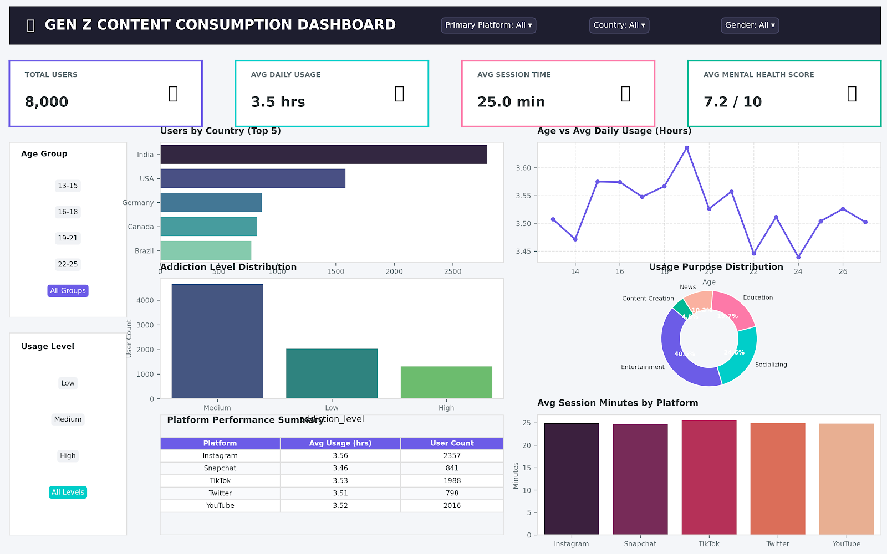

# Gen Z Content Consumption Analytics 📊

An end-to-end data analytics project exploring Gen Z content consumption patterns, platform usage, and daily screen time metrics using **Python, Pandas, Microsoft Excel, and Power BI**.

---

## 🛠️ Tech Stack & Tools

* **Python & Pandas:** Data cleaning, preprocessing, and feature engineering.
* **Microsoft Excel:** Pivot tables, VLOOKUP functions, visual formatting, and data auditing.
* **Power BI:** Interactive dashboards and data visualization.

---

## 📂 Project Overview & Features

### 1. Data Cleaning & Preprocessing (Python & Pandas)
* Handled missing values, standardized column names, and formatted data types.
* Created age group bins (`13-15`, `16-18`, `19-21`, `22-25`) for demographic analysis.
* Calculated daily platform usage averages and engagement distribution metrics.

### 2. Excel Operations & Analysis

* **Pivot Tables:**
  * **Platform-wise User Count:** Created a Pivot Table with `primary_platform` in Rows and `age` (Count) in Values to measure user volume per platform.
  * **Age Group Usage Analysis:** Created a Pivot Table with `age_group` in Rows and `daily_usage_hours` (Average) in Values to observe screen-time trends across age segments.
* **VLOOKUP Reference Sheet:**
  * Created a separate lookup sheet named `Platform Info` with columns: `Platform`, `Category` (Photo/Video/Short-form), and `Founded_Year`.
  * Merged category metrics into the main datasheet using VLOOKUP:
    ```excel
    =VLOOKUP(D2, 'Platform Info'!A:C, 2, FALSE)
    ```
* **Data Visualization (Charts):**
  * Inserted a Bar Chart built directly from the platform user pivot table to visualize platform market share.
* **Conditional Formatting:**
  * Applied a 3-color scale (High = Red, Low = Green) on the `daily_usage_hours` column to visually highlight extreme usage patterns.

### 3. Power BI Dashboard
* Interactive platform performance metrics.
* Demographic filtering by age group and category.
* Key performance indicators (KPIs) for average daily screen time and primary platform preferences.

## 📊 Dashboard Overview



---

## 📜 License

This project is licensed under the [MIT License](LICENSE) - feel free to modify and adapt it for personal or commercial projects.
