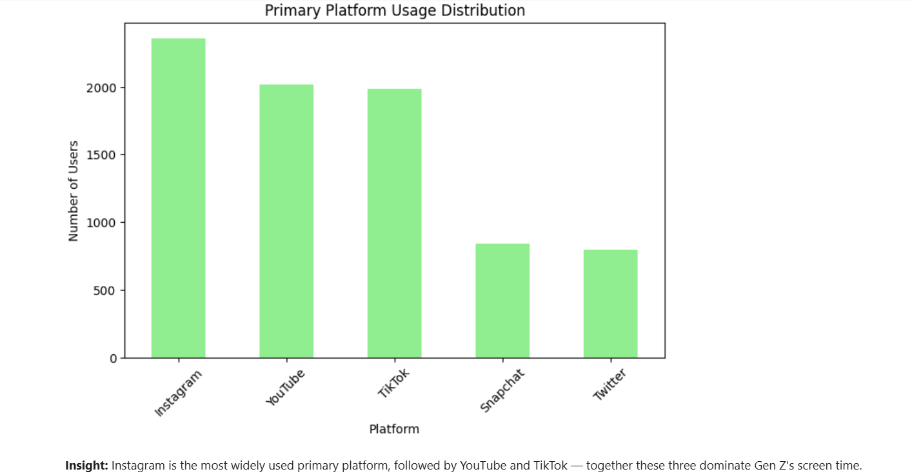
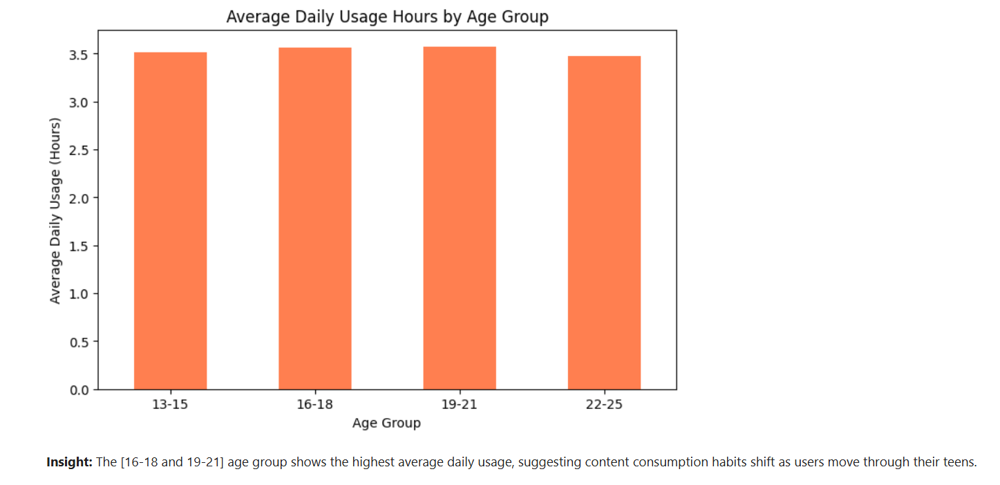
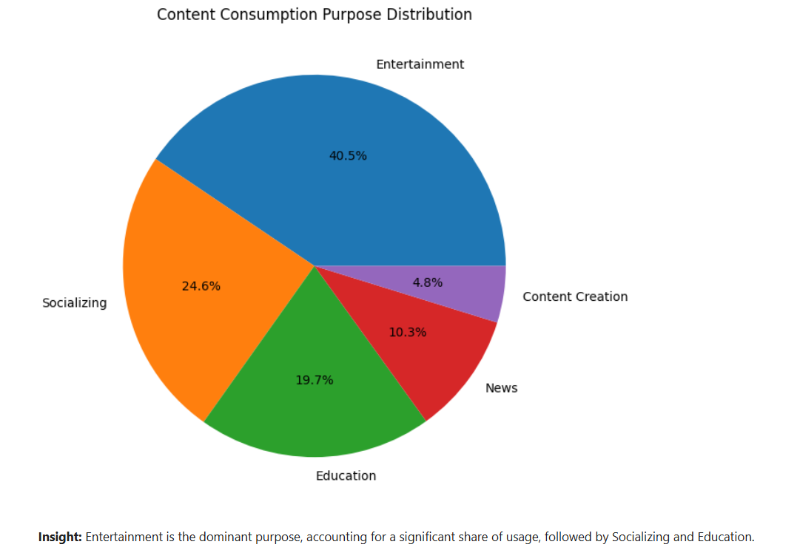
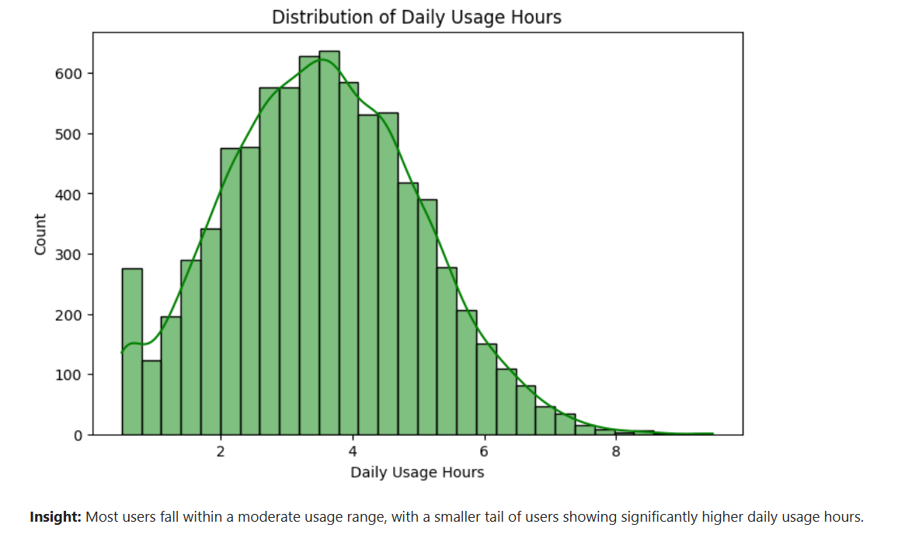
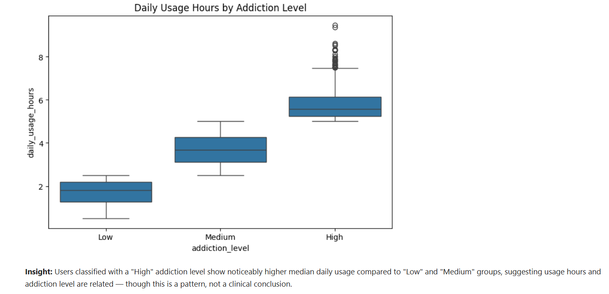
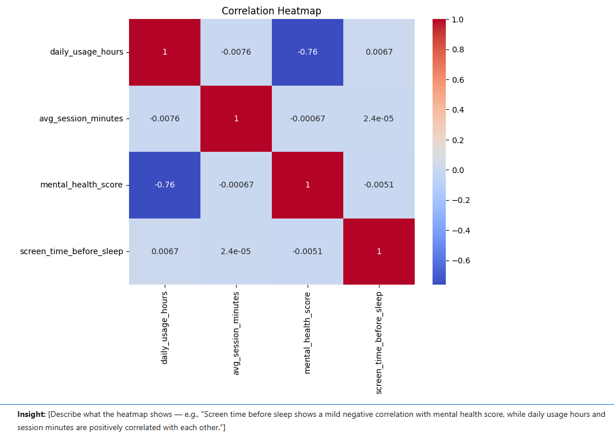

# 📱 Gen Z Content Consumption Analysis

## 📌 Project Overview
Media and social platforms are constantly competing for Gen Z's attention, but
understanding *how* this generation actually consumes content — which platforms
they prefer, how long they stay, and what drives their usage — is key to building
the right content strategy. This project analyzes a sample of 8,000 Gen Z users
to uncover platform preferences, usage patterns, and the relationship between
screen time, purpose, and well-being indicators like sleep and mental health score.

The project covers the full analytics workflow: data cleaning and feature
engineering in Python, cross-verification using Excel, and an interactive
Power BI dashboard for stakeholders to explore the findings visually.

## 🛠️ Tech Stack

## 📁 Files in this Repository
| File | Description |
|------|-------------|
| `genz_content_analysis.ipynb` | Python notebook — data cleaning, feature engineering, and EDA |
| `genz_content_consumption_sample.csv` | Raw sampled dataset (8,000 records) |
| `genz_cleaned_data.csv` | Cleaned dataset with engineered features, used in Excel and Power BI |
| `genz_excel_analysis.xlsx` | Excel workbook — Pivot Tables, VLOOKUP, and conditional formatting |
| `genz_content_dashboard.pbix` | Power BI dashboard file |
| `screenshots/` | Chart and dashboard screenshots referenced below |

## 🧹 Data Preparation (Python)
- Loaded an 8,000-row stratified sample from a larger Gen Z social media usage dataset
- Checked for missing values, duplicate rows, and out-of-range values — dataset was
  already clean, so no imputation or row removal was necessary
- Verified categorical columns (platform, country, purpose) for spelling/formatting
  consistency
- Standardized column names to snake_case for consistency across tools

## 🧠 Feature Engineering
- **`age_group`** — Age binned into ranges (13-15, 16-18, 19-21, 22-25) for
  clearer generational comparisons
- **`usage_level`** — Daily usage hours categorized as Low, Medium, or High
- **`is_heavy_user`** — Flags users spending more than 5 hours daily on content platforms

## 📊 Exploratory Data Analysis (Python — Matplotlib & Seaborn)

### 1. Primary Platform Usage Distribution
*Which platform do most Gen Z users spend their time on?*

### 2. Average Daily Usage by Age Group
*Does content consumption vary across different age groups within Gen Z?*

### 3. Purpose of Content Consumption
*What are users primarily using these platforms for — entertainment, education,
socializing, or something else?*

### 4. Distribution of Daily Usage Hours
*How is daily usage time distributed across all users?*

### 5. Daily Usage Hours by Addiction Level
*Is there a visible relationship between self-reported addiction level and
actual daily usage hours?*

### 6. Correlation Between Usage, Sleep, and Mental Health Indicators
*Exploring whether usage hours or late-night screen time show any relationship
with the mental health score in this dataset.*

*Note: This is a synthetic dataset used for practicing data analysis techniques.
Findings are illustrative and not based on real clinical research.*

## 📗 Excel Analysis
In addition to Python and Power BI, an Excel-based analysis
(`genz_excel_analysis.xlsx`) was built on the same cleaned dataset to
demonstrate core spreadsheet skills:
- **Pivot Tables** summarizing platform-wise user counts and age-group-wise
  average usage hours
- **VLOOKUP** used to cross-reference platform names against a separate
  reference sheet (platform category, founding year)
- **Conditional formatting** applied to daily usage hours to visually highlight
  high vs. low usage users
- A summary bar chart built directly from the Pivot Table output

## 📈 Power BI Dashboard
An interactive dashboard was built to let stakeholders explore the data
without needing to touch code — with KPI cards, platform and demographic
breakdowns, and slicers for country, gender, age group, and usage level.

## 💡 Key Findings
- Instagram, YouTube, and TikTok together account for the majority of Gen Z's
  primary platform usage
- Entertainment is the dominant purpose for content consumption, ahead of
  Education and Socializing
- Usage hours vary meaningfully across age groups, with older teens/young
  adults showing higher average daily usage
- Users with a "High" self-reported addiction level show noticeably higher
  median daily usage than "Low" or "Medium" groups
- Later screen time before sleep shows a mild relationship with mental health
  score in this dataset, though this is a pattern, not a clinical conclusion

## ✅ Recommendations (For a Media/Content Company)
- Prioritize short-form, entertainment-first content given Gen Z's platform
  and purpose preferences
- Tailor content strategy by age group, since usage habits shift noticeably
  across the 13–25 range
- Consider promoting healthy usage awareness, given the observed link between
  usage hours and self-reported addiction level

## 📚 Dataset Source
Sampled from a publicly available Gen Z social media usage dataset, used for
learning and portfolio purposes.

## 👤 Author
**Amit Singh** 
[LinkedIn](linkedin.com/in/amit-singh-da) | [GitHub]([your-github-url](https://github.com/amitsingh-uit/Gen-Z-Content-Consumption-Analysis/edit/main/README.md))
